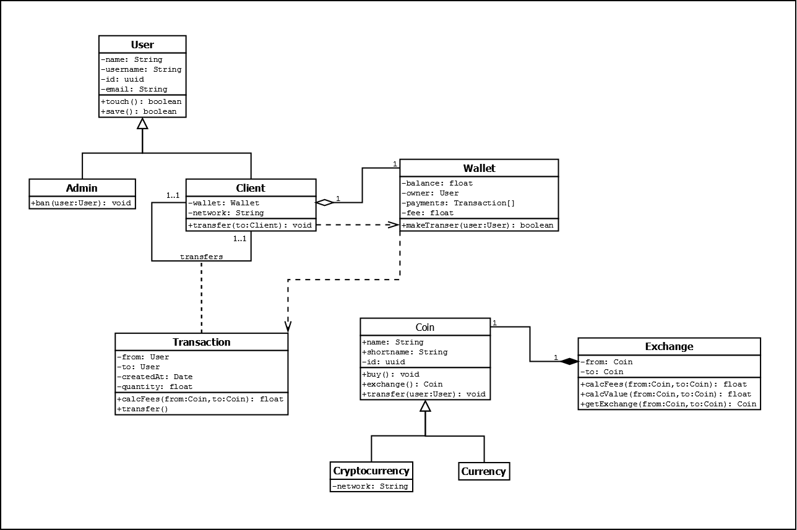
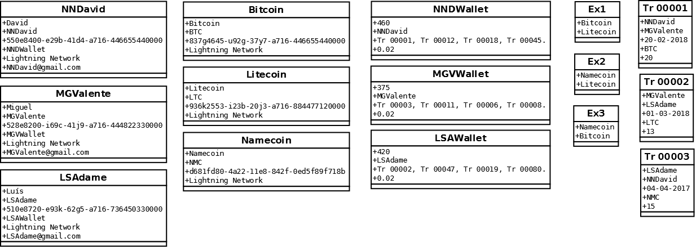
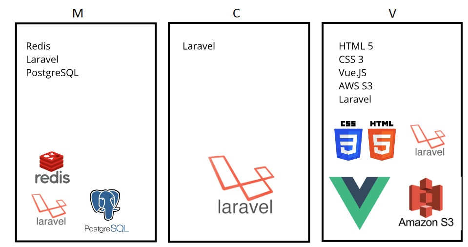
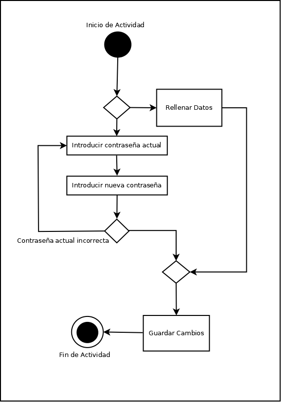
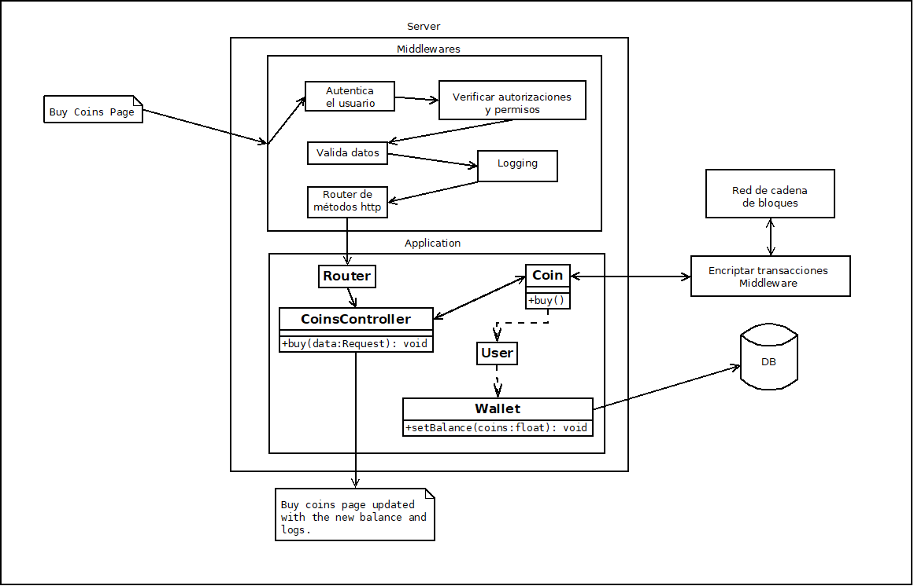

# Coin$Tracker

## Integrantes

- *David García* 
- *Miguel Valiente*
- *Luis Adame*

## ¿En qué consiste?

Con esta aplicación, síguele siempre el rastro de precio
a las **criptomonedas.** Comparamos estadísticamente la **devaluación y auge** de las
monedas como _Bitcoin, Ripple, Litecoin, Dash..._
Además, nuestro sofisticado sistema puede seguirles la pista en **tiempo real.**
También podrás **calcular valores** de una moneda respecto a otra.

## Herramientas Usadas

 - **MockFlow.**  Sencillo de usar y gran variedad de elementos. Limita la cantidad de proyectos para usuarios gratuitos a uno, pero no resulta un inconveniente como tal en este trabajo.
 - **MarkDownPad 2.**  Diseño sencillo, fluído y fácil de comparar lo escrito en Markdown con el resultado final en tiempo real.
 - **Dia Diagram.** Estamos familiarizados con él por su anterior uso en BBDD. Tenemos cierta experiencia usándolo y nos resulta cómodo y rápido.

## MockUps

### Página Principal.

### Página de Registro.

### Página de Estadísticas de la Moneda.

### Página de Compra.

### Página de Perfil de Usuario.

### Página de Información de la Moneda.

### Página de Error 404.

 - Arriba un selector de monedas, una barra de búsqueda, un FAQ...
 - En la gráfica del centro, se puede ver la fluctuación de la moneda cada pocos segundos en tiempo real.
 - A la derecha, un conversor de valores entre monedas.
 - Se ha elegido este diseño porque es intuitivo y fácil de usar por el usuario, a pesar de ser un diseño simple cumple 
    con sus objetivos y es eficiente.

## Diagrama de clases

### Desglose de clases

- **User**: es la clase de la que heredan las clases Admin y Client.
  - Atributos:
    - name: es el nombre real de la persona.
    - username: es el nombre que se vería en la web y usaría para el log in.
    - id: es un identificador para el usuario, compuesto por 32 dígitos hexadecimales divididos en 4 grupos seraparados por guiones. Se expresa de la siguiente manera: 550e8400-e29b-41d4-a716-446655440000.
    - email: es el email del usuario con el que tambien podría acceder en el log in.
  - Métodos:
    - touch():
    - save():

- **Admin**: son los administradores de la web.
	- Atributos: heredados de User.
	- Métodos: 
		- ban(user:User): banea a un usuario.

- **Client**: son los clientes de la web.
	- Atributos:
		- wallet: es la cartera del usuario que contendría sus criptomonedas.
		- network: la red por donde circulan las criptomonedas. 
	- Métodos: 
		- transfer(to:Client): llama al metodo makeTransfer(user:User) de la clase wallet para que cree una nueva transacción.     

- **Coin**: es una clase abstracta de la que heradan las clases MonedaFisica y Criptomoneda(Cambiar nombres).
	- Atributos:
  		- name: es el nombre completo de la moneda. Ej: Bitcoin.
  		- shortname: son las siglas por las que se reconoce la moneda. Ej: BTC.
  		- id: es un identificador propio de la moneda y sigue el mismo patrón que el id del User.
  		- network: la red por donde circulan las criptomonedas.
  	- Métodos:
  		- buy(): método para comprar monedas.
  		- exchange(): método para cambiar monedas por otras.
  		- transfer(user:User): método para intercambiar monedas con otros usuarios.

- **Wallet**: es el monedero del usuario, a cada usuario se le asigna un monedero cuando crea su perfil.
	- Atributos:
		- balance: es el balance de monedas que el usuario posee.
		- owner: el el dueño de la cartera.
		- payments: es un array en el que se guardan todos los pagos/transacciones realizadas con esa cartera.
		- fee: es la tarifa de conversión entre monedas.
	- Métodos:
		- makeTransfer(user:User): crea una nueva transacción.

- **Exchange**: son los intercambios que se llevan acabo a la hora de convertir una moneda en otra.
	- Atributos:
		- from: es el tipo de moneda que se desea cambiar.
		- to: es el tipo de moneda al que se desea cambiar.
	- Métodos:
		- calcFees(from:Coin,to:Coin): calcula la tarifa de conversión de monedas.
		- calcValue(from:Coin,to:Coin): calcula el valor final de la conversión.
		- getExchange(from:Coin,to:Coin): getter del intercambio.

- **Transaction**: son los intercambios que se realizan entre usuarios.
	- Atributos: 
		- from: es el usuario que ha iniciado la transacción.
		- to: es el usuario al que se le ha ofrecido la transacción.
		- createAt: es la fecha en la que se ha creado la transacción.
		- quantity: es la cantidad que se va a intercambiar.
	- Métodos:
		- calcFees(from:Coin,to:Coin):calcula la tarifa de conversión de monedas.
		- transfer(): método que realiza la transacción.

## Diagrama de objetos

## CMS(Content Management System)
Hemos elegido Wordpress para realizar el blog para la página web.
Este cms tiene muchas ventajas para hacer un blog pero las principales por las que lo hemos elegido son:
- Eres el legitimo propietario del blog, es decir, puedes hacer lo que quieras con él, incluso llegar a venderlo. Otros cms no te dan esta opción y aunque tú puedas modificar el blog o la web éstos no son de tu propiedad.
- Tiene buen posicionamiento en buscadores.
- Tiene un gran catálogo de plugins de todo tipo.
- Es 100% responsive. Ésta es de las más importantes ya que amplía nuestro espectro de clientes no solo en PC, sino también en otros dispositivos.

## Conjunto de tecnologías elegidas

### Backend
|Tecnología|Descripción|
|--|--|
|[Docker](https://www.docker.com/)|Ayuda al mantenimiento de la aplicación y despliegue|
|[Laravel](https://laravel.com/)|PHP framework, será el nucleo de la aplicación, manejará usuarios, base de datos, etc... Laravel está basado en PHP que es un lenguaje diseñado para la web. Con la salida de la séptima version de php su rendimiento a mejorado muchísimo y se puede mejorar aún más con ciertas extensiones.|
|[Swoole](https://www.swoole.co.uk/)|Extensión de php que permitirá crear websockets directamente en php y transmitir datos en tiempo real. Mejora el rendimiento de php.|
|[PostgreSQL](http://postgresql.org/)|Base de datos. Tiene un mejor soporte del tipo de datos JSON sobre MySQL/MariaDB, y esta aplicación va a tratar mucho este tipo de datos. Tiene un mejor rendimiento.|
|[Redis](https://redis.io/)|Permite cachear datos eficientemente y envío de mensajes|
|[AWS S3](https://aws.amazon.com/s3/)|Servirá como cdn para transmitir los recursos estáticos más rápido|

### Frontend
|Tecnología|Descripción|
|--|--|
|HTML|Lenguage de marcado por defecto para la web|
|CSS|Diseño|
|[SCSS](http://sass-lang.com/)|Preprocesador de css que nos permitirá modularizar el css, crear funciones, usar bucles y funcionalidades muy útiles|
|[Webpack](https://webpack.js.org/)|Empaqueta los recursos estáticos, compila scss, corre los tests automaticamente, minimiza los archivos, etc...|
|[Vue.JS](https://vuejs.org)|JS Framework, nos permite realizar vistas dinamicas, resuelve problemas de compatibilidad entre navegadores. Se usaría para obtener los datos del backend proporcionados por su api. Vue es un framework con mucha comunidad, permite la modularización de las vistas y tiene muy buen rendimiento.|
|[Karma](http://karma-runner.github.io)|Test runner, realizaría todos los tests, fácil de integrar con vue y webpack. Vue recomienda karma.|
|[Mocha](https://mochajs.org/)|Test framework, fácil de integrar con karma. Con gran comunidad que lo apoya.|
|[Git](https://git-scm.com/)|Sistema de control de versiones para poder mantener un historial de cambios, organizar nuevas propuestas y bugs y mejora el trabajo colaborativo.|
|[Yarn](http://yarnpkg.com/)|Gestor de paquetes, permite añadir dependencias al proyecto más fácilmente, actualizarlas, etc.|
|[Babel](https://babeljs.io/)|Compilador de Javascript que asegura el correcto funcionamiento de las últimas funcionalidades de javascript en navegadores más antiguos.|
|[Lighthouse](https://github.com/GoogleChrome/lighthouse)|Analiza la aplicación web y recoje estadísticas del rendimiento y del uso de buenas prácticas.|
|[Tailwind](https://tailwindcss.com/)|CSS Framework que permite un desarrollo más ágil.|
|[Pug](https://pugjs.org/api/getting-started.html)|Template Engine|

## Diagramas de casos de uso
### Página principal

### Commerce

### Profile

### Coin Stats

### Log-In

### Coin Info

## Fichas técnicas de casos de uso
- [Ficha para la conversión de monedas en la página principal](docs/Data%20sheets/Coin%20converter%20-%20Data%20sheet.md)
- [Ficha para la compra de monedas en la página commerce](docs/Data sheets/Buy Coin - Data Sheet.md)
- [Ficha para la compra de monedas en la página coininfo](docs/Data%20Sheets/Coin%20Info%20-%20Data%20Sheet.md)
- [Ficha para la compra de monedas en la página login](docs/Data%20Sheets/LogIn%20-%20Data%20Sheet.md)
- [Ficha para la compra de monedas en la página profile](docs/Data%20Sheets/Profile%20-%20Data%20Sheet.md)

## Diagramas de Flujo de Actividad.
### Profile

### Página principal
#### Conversor de monedas

#### Selección de monedas

### Página Commerce

### Página Login

### Petición de Transacción

## Diagrama del flujo web
En el diagrama podemos observar los caminos que toma la aplicacíon al realizar una compra de criptomonedas desde la página para ello.

La petición se realiza al punto de destino: `/api/v1/coins/buy` con un método *post* y pasa por múltiples middlewares que verifican la existencia del usuario y lo identifican, validan datos, loggean acciones, e identifican que tipo de método http se ha usado y qué formato de salida tendrán los datos en la respuesta del servidor.

El router del framework se encarga de llamar al método correspondiente del controlador estipulado. En este caso el método *buy* del controlador: `CoinsController` será ejecutado. En este método haremos uso de la clase `Coin` y de su método *buy*. En este método crearemos una transacción en la que accedera a la red de cadena de bloques y obtendremos la cantidad de monedas indicadas. Estos datos vuelven encriptados a la clase `Coin` y entonces obtiene el usuario autenticado, accede a su `Wallet` y ejecuta el método *setBalance* que modificará el balance de la cuenta conforme el número de monedas compradas accediendo a la base de datos y modificando la fila exacta.

Una vez el método *buy* de la clase `Coin` se ha ejecutado satisfactoriamente, enviaremos la respuesta al cliente probablemente en formato *json* y nuestra parte de la aplicación en el cliente recibirá esta respuesta y actualizaremos la página conforme a los datos devueltos por el servidor.

## Middlewares

Como la aplicación hace uso de la autenticación de usuarios y de sus sesiones entonces será necesario el uso de un middleware que se encargue de **autenticar** a los usuarios en cada petición que se realice y también la **gestión de las sesiones** de dichos usuarios autenticados, para así, por ejemplo, determinar el tiempo de inactividad del usuario y cerrar la sesión de aquellos que hayan tenido la sesión inactiva durante 30 minutos.

Además, nuestra aplicación define varios tipos de usuario: administrador, cliente, visitante.
De aquellos que son visitantes no realizaremos ningún seguimiento de sesiones, pero en el caso del administrador y clientes tenemos que dejar bien claras sus diferencias. Las diferencias claras entre ambos tipos de usuarios son los permisos y autorizaciones que tienen independientemente, es decir, el administrador tendrá unos permisos dados para poder manejar ciertos recursos mientras que los clientes no. Y el administrador tendrá autorizaciones dadas para poder realizar ciertas acciones que los clientes no pueden realizar, como puede ser banear a otro usuario. Entonces, es necesaria la existencia de un middleware de **permisos y autorización** para que controle las acciones de los usuarios.

Precisamos de un **middleware que registre** (*logging*) todos los movimientos que se realizan dentro de la aplicación, en el caso de los clientes este registro solo será visible para ellos mismos y en el caso de los administradores sus registros serán públicos para los demás administradores. Esto es útil, por ejemplo, si un cliente quiere recordar o revisar que movimientos, acciones, transferencias o cualquier acción realizada, y en el caso de los administradores es importante que se vean claros los registros entre ellos para verificar que ninguno está ejerciendo ningún abuso de poder o acciones que pueden repercutir negativamente en el sistema.

**Encriptación de transacciones**: las transacciones tienen que ser enviadas entre máquinas estando encriptadas para que no surga un filtro de información privada y confidencial.

Necesitamos un middleware que realice un correcto enrutamiento de los métodos http. Así podemos crear *apis* que sean consumidas fácilmente. Por ejemplo: si se realiza una petición de javascript asíncrona entonces sabremos que los datos tendrán que ser devueltos en formato *json*. En el caso de este ejemplo el middleware es el que se encargaría de detectar que es una petición realizada por *ajax* y que se tiene que devolver *json*. Esto es importante porque nuestra aplicación es posible que sea portada a diferentes tecnologías que sean soportadas en distintos sistemas operativos o dispositivos, y probablemente estos clientes deberán de hacer uso de *apis* internas.

La **validación** de datos es realmente importante en nuestra aplicación (en el caso de una transferencia por ejemplo). Si tuviesemos una frágil implementación de validación de datos estaríamos dejando una ventana para posibles ciberataques. Lo cual resultaría fatal en una aplicación que maneja monedas. Por tanto, necesitamos un middleware que se encarge de validar y sanear los datos provenientes de las peticiones.

**Manejo de errores**. Un middleware que se encargue de manejar errores del servidor, es decir, cuando la respuesta del servidor es de un error interno (500) entonces el middleware detectaría dicho caso y mostraría una página estática o un mensaje más agradable al usuario que un código de error.

## Herramientas DevOps

### Git

Forma parte de la categoría de código. Git realiza un control de versiones del código o mejor dicho de los archivos del repositorio y sincroniza dichos cambios o versiones con otras personas.

#### Características
- Desarrollo no lineal. Esto quiere decir que soporta la creación y fusión de ramas, lo que nos permite implementar características a nuestro proyecto sin depender de que otra característica se implemente antes. Una ventaja de esto podría ser en la creación de parches a nuestro código en producción, sin tener que modificar código en desarrollo.
- Desarrollo distribuido. Cada desarrollador tiene una copia del historial de desarrollo y los cambios son copiados de un repositorio a otro. Estos cambios se pueden fusionar a los cambios locales.
- Compatible con múltiples sitemas y protocolos como pueden ser http, ftp, rsync, ssh, etc.
- Alto rendimiento con proyecto muy grandes.

#### Diferencias con *Subversion*
En primer lugar git es descentralizado mientras que subversion hace uso de una localización para su repositorio, esto permite que puedas realizar cambios a un repositorio sin estar conectado a internet ya que cada persona tiene una copia local del proyecto e historial en su ordenador.
Por otro lado subversion tiene una curva de aprendizaje mucho mas plana y eso puede resultar en una productividad mayor.

### Jenkins

Jenkins es un servidor de automatización que nos ayuda a **construir, desplegar y automatizar** cualquier proyecto. Esta herramienta entraría dentro de la categoria de construcción.

#### Características
Jenkins es una herramienta multiplataforma para la **integración continua** de nuestro proyecto. Posee una interfaz gráfica y de consola.

Jenkins es muy flexible porque te permite añadir plugins de una lista que posee y te permite aladir tus propios plugins, por tanto, es también muy extensible. 

Destaca también por la distribución de construcciones y pruebas de carga en múltiples máquinas.

#### Diferencias con *Travis CI*
Travis CI es una de las soluciones de integración continua más maduras de la industria. Y aunque para proyectos *open source* el plan es gratuito, aquellos proyectos privados tendrán únicamente las primeras cien construcciones gratis, después tendrás que escoger un plan de suscripción. Mientras que Jenkins es una herramienta gratuita y bajo licencia MIT.

Sin embargo, Jenkins puede ser, al principio, la curva de aprendizaje es inclinada pero vale totalmente la pena.

### Parasoft

Parasoft es una herramienta de pruebas continuas muy conocida que realiza pruebas funcionales y que se utiliza también para hacer pruebas continuas. Esto ayuda a lanzar versiones del software que no tengan defectos de forma eficiente y que no consuma un tiempo preciado para los ingenieros.

#### Características
- Reduce los riesgos relacionados con el lanzamiento de software.
- Reduce el coste y el tiempo en el proceso de desarrollo.
- Asegura que la calidad del proyecto sea la mejor elminando los posibles defectos no detectados.

#### Diferencias con *Sealights*
Sealights es una herramienta basada en la nube mientras que Parasoft no.
Parasoft cuenta con una comunidad grande que respalda esta herramienta mientras que sealights es un producto más reciente.

### Sonatype

Sonatype es un repositorio de artefactos con un soporte muy extenso para formatos populares. Los repositorios de artefactos nos permiten separar diferentes componentes de nuestra aplicación que pueden ser muy infecientes de mantener controlados con un sistema de control de versiones convencional como git. Porque podemos tener diferentes paquetes como el código fuente, la aplicación compilada (binario), documentación, etc. Y por tanto para un sistema de control de versiones sería muy complicado mantener controlado las versiones de un paquete binario.

#### Características
- Repositorio centralizado.
- Única fuente de verdad para todos los binarios y artefactos construidos.
- Proporciona conocimiento sobre la seguridad, licencias y problemas de calidad de componentes.

#### Diferencias con *JFrog*
*Jfrog* actua también como un repositorio de artefactos a diferencia que es un software de pago. Ofrece una solución híbrida entre la nube o hosteado.

### Codeship

Codeship es una herramienta que nos permite realizar integración y lanzamientos continuos en la nube. Lo que nos permite agilizar mucho el proceso de desarrollo. Al ser un servicio en la nube no tenemos que gastar tiempo y recursos en mantener una infraestructura para realizar estas mismas operaciones.

#### Características
- Codeship ofrece un plan gratuito que te permite realizar:
	- 100 construcciones al mes
	- Usuarios ilimitados
	- Proyectos ilimitados
- Si el proyecto es open source todo es gratis.
- Buen soporte al cliente.
- Buena seguridad a través de ssh.

#### Diferencias con *ElectricCloud*
ElectricCloud sirve también como una herramienta de lanzamiento/construcción continua. Sin embargo, es gratuita en todos sus aspectos, pero no es basada en la nube. Ofrece gran parte de las características que ofrece Codeship.

### Terraform
Con Terraform podemos configurar la infraestructura en la que vamos a correr nuestros servicios a travñes de un simple archivo de configuración. Y con esto logramos automatizar el proceso de creación de infraestructuras, así una vez mas, agilizando el proceso de desarrollo.

#### Características
- Simple API con la que podemos definir nuestra infrastructura en archivo *JSON*.
- Esto permite el almacenamiento de cómo es nuestra infraestructura en un sistema de control de versiones.
- La automatización y codificación de nuestra infraestructura es fácil de realizar ya que el archivo permite el uso de variables y muchas de las características que ofrece *ECMAScript*.

#### Diferencias con *Puppet*
Realmente Terraform se enfoca en un nivel más alto de abstracción que puppet. De hecho, Terraform permite cualquier tipo de herramineta de control de configuración para que monte un recurso una vez se ha creado. Por tanto, estas herramientas funcionan conjuntamente.

### Ganglia

Esta herramienta ofrece capacidades de monitorazión de clusters y grids. Esta herramienta escalable está diseñada para sistemas de alto rendimineto como cluster y grids. Su costo es gratuito.

#### Características
- Sistema de monitorización escalable y distribuido basado en un diseño jerárquico enfocado en conjunto de clusters.
- Enfocado en gastos de consumo bajos por nodo para alta concurrencia.
- Puede escalar para manejar clusters de hasta 2000 nodos.

#### Diferencias con *Nagios*
Nagios es el estándar en monitorización de infraestructuras, pero tiene un coste muy elevado. Y Nagios suele ofrecer mejores características en casi todos los aspectos en Ganglia.

### Vagrant

Vagrant es una herramienta para construir y administrar entornos de máquinas virtuales. Se enfoca en un flujo de trabajo sencillo y en la automatización. Esto ayuda a reducir los tiempos de montaje de entornos de desarrollo y erradica las incompatibilidades entre sistemas de desarrollo, es decir, si funciona en una entorno de vagrant, funciona en todos.

#### Características
- Simple y potente por su API.
- Hace que el entorno de desarrollo se asemeje lo máximo posible al de producción para evitar fallos inesperados.
- Es multiplataforma.

#### Diferencias con *Docker*
Docker es una herramienta de administración de contenedores. Esto significa que Docker consume menos recursos que Vagrant porque los contenedores no están basados en el software de virtualización llamado *Hypervisor*. 

## Cookies

Haremos uso de Cookies para mejorar su experiencia de navegación en esta web.
Debe dar su consentimiento para poder llevar a cabo esta acción.

Nuestro uso de las cookies será dedicado a:
- Recordar los datos de Usuario, como el nombre de usuario y contraseña.
- Mantener tu sesión iniciada.
- Recopilar información sobre los movimientos comunes entre usuarios, respecto a compras, monedas más utilizadas...

El empleo de estos datos será exclusivamente con vista mejoras de la experiencia de uso del usuario con la propia aplicación.

## Cloud
- Microsoft Azure

### Tipo de Nube
- Nube tipo IaaS (Infrastructure as a Service).

### Características
- Permite el alojamiento de nuestra aplicación web en un entorno virtual controlado en la nube. 
- Hace uso de un OS especializado que maneja los recursos almacenados y procesamiento para proveer parte de los recursos para las aplicaciones alojadas.
- Ofrece un servicio de almacenamiento de copias de seguridad ante cualquier fallo en la tecnología. Éstas quedan cifradas.
- Está sujeta a una estricta normativa de privacidad, para mantener a salvo los datos de privacidad de nuestros usuarios.

### Empleo
Usaríamos esta tecnología para mantener los datos de nuestras criptomonedas, así como de los usuarios clientes, sus carteras, transacciones, y copias de seguridad de dichos datos.

### BlockChain
El blockchain seria aplicable a la hora de realizar transacciones en nuestra web, mandando la transacción a la red para ser validada por los miembros de la red, después de su validación la transacción pasara a formar parte de la cadena y se realizará la transacción.

Ventajas:
- El Blockchain otorga mayor seguridad, rapidez y eficacia.
- Es público, descentralizado, transparente e inmutable. Los datos cifrados son accesibles para todos en la red.

### Big Data
En nuestro caso se podrian hacer big data los valores de las monedas que estan en constante cambio, por lo tanto se generan gran cantidad de datos. Otro ejemplo serían los log de usuarios donde se veria todo lo que realizan los usuarios, inicios de sesión, cambio en el perfil de usuario, etc. 
Con MongoDB podemos acceder a los datos mediante claves, por ejemplo con el nombre de la criptomoneda obtendriamos todos los valores que va teniendo. Y con el id de usuario podriamos acceder a todas las actividades que ha realizado el usuario.

## Bibliografía
 -  [MarkDownPad 2](http://markdownpad.com/) y [Typora](https://typora.io)
 -  [MockFlow](https://www.mockflow.com/)
 -  [.gitignore](http://aprendegit.com/tag/gitignore/)
	-	[Draw.io](https://www.draw.io): realización de los diagramas de casos de uso.
