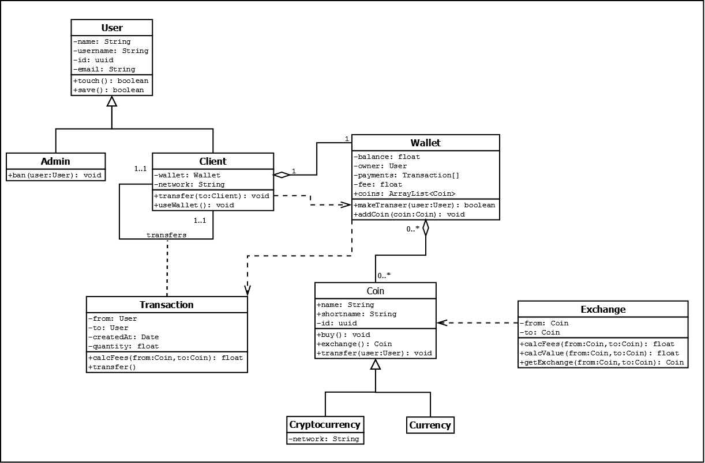

# Coin$Tracker

## Integrantes

- *David García* 
- *Miguel Valiente*
- *Luis Adame*

## ¿En qué consiste?

Con esta aplicación, síguele siempre el rastro de precio
a las **criptomonedas.** Comparamos estadísticamente la **devaluación y auge** de las
monedas como _Bitcoin, Ripple, Litecoin, Dash..._
Además, nuestro sofisticado sistema puede seguirles la pista en **tiempo real.**
También podrás **calcular valores** de una moneda respecto a otra.

## Herramientas Usadas

 - **MockFlow.**  Sencillo de usar y gran variedad de elementos. Limita la cantidad de proyectos para usuarios gratuitos a uno, pero no resulta un inconveniente como tal en este trabajo.
 - **MarkDownPad 2.**  Diseño sencillo, fluído y fácil de comparar lo escrito en Markdown con el resultado final en tiempo real.
 - **Dia Diagram.** Estamos familiarizados con él por su anterior uso en BBDD. Tenemos cierta experiencia usándolo y nos resulta cómodo y rápido.

## MockUps

### Página Principal.

### Página de Registro.

### Página de Estadísticas de la Moneda.

### Página de Compra.

### Página de Perfil de Usuario.

### Página de Información de la Moneda.

 - Arriba un selector de monedas, una barra de búsqueda, un FAQ...
 - En la gráfica del centro, se puede ver la fluctuación de la moneda cada pocos segundos en tiempo real.
 - A la derecha, un conversor de valores entre monedas.
 - Se ha elegido este diseño porque es intuitivo y fácil de usar por el usuario, a pesar de ser un diseño simple cumple 
    con sus objetivos y es eficiente.

## Diagrama de clases

### Desglose de clases

- **User**: es la clase de la que heredan las clases Admin y Client.
  - Atributos:
    - name: es el nombre real de la persona.
    - username: es el nombre que se vería en la web y usaría para el log in.
    - id: es un identificador para el usuario, compuesto por 32 dígitos hexadecimales divididos en 4 grupos seraparados por guiones. Se expresa de la siguiente manera: 550e8400-e29b-41d4-a716-446655440000.
    - wallet: es la cartera del usuario que contendría sus criptomonedas.
    - network:
    - email: es el email del usuario con el que tambien podría acceder en el log in.
  - Métodos:
    - touch():
    - save():

- **Coin**: es una clase abstracta de la que heradan las clases MonedaFisica y Criptomoneda(Cambiar nombres).
	- Atributos:
  		- name: es el nombre completo de la moneda. Ej: Bitcoin.
  		- shortname: son las siglas por las que se reconoce la moneda. Ej: BTC.
  		- id: es un identificador propio de la moneda y sigue el mismo patrón que el id del User.
  		- network:
  	- Métodos:
  		- buy(): método para comprar monedas.
  		- exchange(): método para cambiar monedas por otras.
  		- transfer(user:User): método para intercambiar monedas con otros usuarios.

- **Wallet**: es el monedero del usuario, a cada usuario se le asigna un monedero cuando crea su perfil.
	- Atributos:
		- balance: es el balance de monedas que el usuario posee.
		- owner: el el dueño de la cartera.
		- payments: es un array en el que se guardan todos los pagos/transacciones realizadas con esa cartera.
		- fee:
	- Métodos:
		- makeTransfer(user:User):

- **Exchange**: son los intercambios que se llevan acabo a la hora de convertir una moneda en otra.
	- Atributos:
		- from: es el tipo de moneda que se desea cambiar.
		- to: es el tipo de moneda al que se desea cambiar.
	- Métodos:
		- calcFees(from:Coin,to:Coin):
		- calcValue(from:Coin,to:Coin):
		- getExchange(from:Coin,to:Coin): 

- **Transaction**: son los intercambios que se realizan entre usuarios.
	- Atributos: 
		- from: es el usuario que ha iniciado la transacción.
		- to: es el usuario al que se le ha ofrecido la transacción.
		- createAt: es la fecha en la que se ha creado la transacción.
		- quantity: es la cantidad que se va a intercambiar.
	- Métodos:
		- calcFees(from:Coin,to:Coin):
		- transfer(): método que realiza la transacción.

## Diagrama de objetos

## Bibliografía
 -  [MarkDownPad 2](http://markdownpad.com/) y [Typora](https://typora.io)
 -  [MockFlow](https://www.mockflow.com/)
 -  [.gitignore](http://aprendegit.com/tag/gitignore/)
